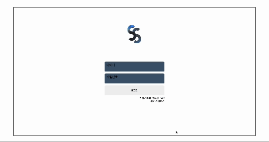
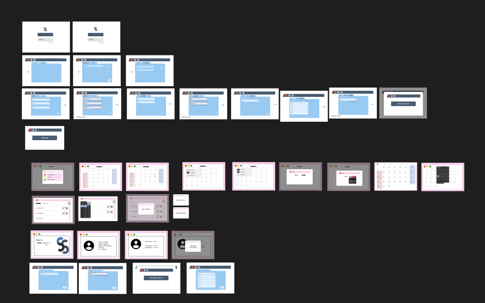

# 🗓 스케줄러 (Vanilla JS)

#### 목적: 회사 내 팀원들의 스케줄을 부서별로 확인하고 효율적으로 관리하기 위한 웹 애플리케이션

이 프로젝트는 **바닐라 JavaScript (Vanilla JS)**를 사용하여 클라이언트 측 로직을 구현하였으며, 간단한 UI와 직관적인 기능을 제공합니다.  
서버 측에서는 JSP(Java Server Pages)를 활용하여 데이터를 처리하고 데이터베이스와의 연결을 담당합니다.

## [](http://www.mannomi.store:8080/SCHEDULER/ROOT/jsp/page/index.jsp)

## 🚀 프로젝트 개요

**스케줄러 프로젝트의 주요 목표는 다음과 같습니다:**

- 팀원들이 개별적으로 스케줄을 확인하고 효율적으로 관리할 수 있도록 함.
- 별도의 프레임워크 없이 **순수 HTML, CSS, JavaScript(ES6+ Vanilla JS)**를 이용한 클라이언트 로직 구현.
- JSP 및 MariaDB를 통한 서버 측 데이터 관리.

---

## 🛠 사용한 기술스택 모음

### **프론트엔드 (Frontend)**

- **HTML5 / CSS3**: 레이아웃 구성 및 스타일링
- **Vanilla JavaScript (ES6+)**:
  - DOM 조작 및 이벤트 핸들링
  - `fetch API`를 이용한 백엔드와의 통신
  - 로컬 스토리지를 활용한 간단한 상태 관리

### **백엔드 (Backend)**

- **JSP (Java Server Pages)**: 서버 사이드 로직 처리
- **Servlet**: 요청 및 응답 핸들링
- **MariaDB**: 스케줄 정보를 저장 및 조회
- **JDBC**: 데이터베이스 연결 및 쿼리 실행

---

## 📸 프로젝트 시연

<table align="center">
  <tr>
    <td align="center">
      
      <br><b>프로젝트 실행 화면</b>
    </td>
    <td align="center">
      
      <br><b>Figma 디자인 화면</b>
    </td>
  </tr>
</table>

---

## 📄 프로젝트 문서

### 요구사항 명세서

프로젝트의 전체 요구사항을 문서화한 파일입니다.

[](./docs/요구사항명세서.md)

---

### JSP 이용 가이드

서버 측 JSP 사용 방법 및 설정 방법을 안내하는 문서입니다.

[](./docs/JSP.md)

---

## 📂 프로젝트 구조

```plaintext
.
├── README.md
├── ROOT
│   ├── common
│   │   ├── reset.css
│   │   └── rootCSS.css
│   ├── component
│   │   ├── button
│   │   └── placeHorder
│   ├── css
│   ├── image
│   ├── js
│   │   ├── detail_page.js
│   │   ├── find_page.js
│   │   ├── join_page.js
│   │   ├── login_page.js
│   │   ├── profile_page.js
│   │   ├── schedule_page.js
│   │   └── theme_page.js
│   ├── jsp
│   │   ├── action
│   │   └── page
│   ├── reset
│   │   └── reset.css
│   └── rootCSS
│       └── rootCSS.css
└── docs

20 directories, 25 files

```

📢 설치 및 실행 방법

1.  프로젝트 클론

```
git clone https://github.com/your-repo/scheduler.git
cd scheduler
```

    2.	프론트엔드 실행 (로컬 파일)
    •	index.html을 브라우저에서 직접 열기
    3.	백엔드 실행 (Tomcat 서버 필요)
    •	Tomcat에 배포 (webapps 폴더에 복사)
    •	http://localhost:8080/scheduler로 접속
    4.	데이터베이스 설정
    •	MariaDB 실행 후 db/schema.sql 파일 실행

---

👨‍💻 개발자 가이드 1. 프론트엔드 수정 방법
• src/app.js에서 로직 수정
• CSS 변경 시 src/styles.css 조정 2. 백엔드 수정 방법
• server/ 디렉토리 내 JSP 파일 수정
• MariaDB 연결 정보 (web.xml 설정) 수정
